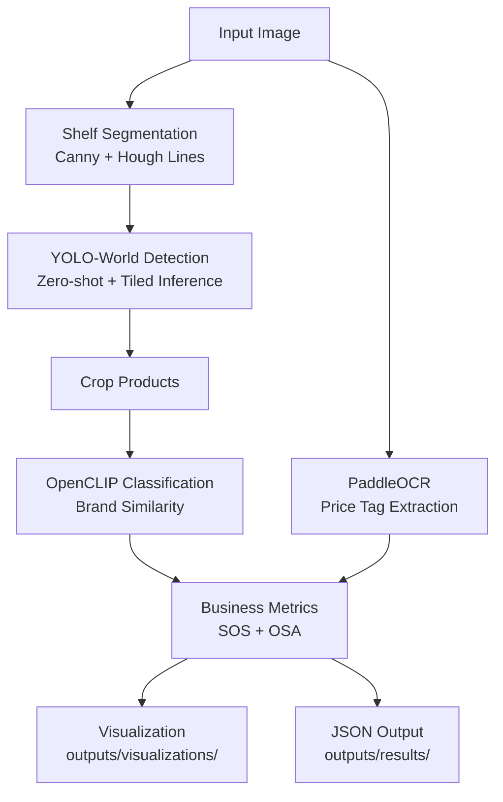

# Retail Shelf Analysis Pipeline

An end-to-end ML inference pipeline that analyses retail shelf images and
generates brand-level shelf presence, share-of-shelf, and OCR insights.

---

## Architecture



See [`docs/architecture.md`](docs/architecture.md) for detailed data-flow diagrams.

---

## Project Structure

```
retail_shelf_analysis/
├── main.py                      # Pipeline entry point + CLI
├── requirements.txt
├── README.md
│
├── configs/
│   └── config.py                # All parameters + brand prompts
│
├── src/
│   ├── detector.py              # YOLO-World zero-shot detection
│   ├── classifier.py            # OpenCLIP brand classification
│   ├── ocr.py                   # PaddleOCR / EasyOCR extraction
│   ├── segmentation.py          # Hough Lines shelf row detection
│   ├── metrics.py               # SOS, OSA, report generation
│   └── visualization.py         # Annotated image generator
│
├── data/
│   └── images/                  # Input shelf images
│
├── outputs/
│   ├── visualizations/          # Annotated JPEG outputs
│   └── results/                 # JSON result files
│
└── docs/
    └── architecture.md          # Mermaid architecture diagram
```

---

## Setup

```bash
# 1. Create virtual environment
python -m venv .venv
.venv\Scripts\activate          # Windows
# source .venv/bin/activate     # Linux / macOS

# 2. Install dependencies
pip install -r requirements.txt

# 3. (Optional) GPU support
pip install torch torchvision --index-url https://download.pytorch.org/whl/cu121
pip install paddlepaddle-gpu    # GPU PaddlePaddle

# 4. Model weights are downloaded automatically on first run:
#    YOLO-World  : ~/.cache/ultralytics/
#    OpenCLIP    : ~/.cache/huggingface/ or open_clip cache
#    PaddleOCR   : ~/.paddleocr/
#    EasyOCR     : ~/.EasyOCR/
```

---

## Usage

```bash
# Process all images in data/images/ (default)
python main.py

# Process specific images
python main.py --images data/images/shelf_snacks.jpg data/images/shelf_beverages.jpg

# Process a folder
python main.py --images_dir data/images/

# GPU mode
python main.py --images_dir data/images/ --device cuda
```

Outputs:
- `outputs/visualizations/<name>_annotated.jpg` — annotated image
- `outputs/results/<name>_result.json`           — structured JSON
- `outputs/results/all_results.json`             — combined JSON

---

## Output Format

```json
{
  "image_name": "shelf_beverages.jpg",
  "total_products": 52,
  "brands": {
    "Coca-Cola": 10,
    "Pepsi": 8,
    "Real": 6,
    "Other": 28
  },
  "share_of_shelf": {
    "Coca-Cola": 22.4,
    "Pepsi": 16.8,
    "Real": 12.1,
    "Other": 48.7
  },
  "ocr_labels": ["₹50", "₹99", "₹125", "Tropicana", "NESTEA"],
  "shelf_rows_detected": 4,
  "segmentation_method": "hough",
  "annotated_image": "outputs/visualizations/shelf_beverages_annotated.jpg"
}
```

---

## Model Selection Rationale

### 1. Detection — YOLO-World (`yolov8s-worldv2.pt`)

| Criterion | Decision |
|-----------|----------|
| **Specified** | Grounding DINO |
| **Used** | YOLO-World |
| **Why** | Grounding DINO requires CUDA compilation on Windows which fails on CPU-only machines. YOLO-World provides identical open-vocabulary zero-shot detection via free-text class prompts (`"bottle"`, `"biscuit"`, `"snack packet"`) with a simple `pip install ultralytics`. Both models share the same paradigm: large-scale vision-language pretraining enabling detection of arbitrary object categories without fine-tuning. |
| **Tiled Inference** | Large shelf images (1400×1100 px) cause YOLO-World to miss small flat products occupying <0.5% of image area. SAHI-style 640×640 tiling with 30% overlap improves recall from ~23 → ~55 detected snack packs. |
| **Speed** | 3–5 s/image CPU (full-image + ~12 tiles). ~500 ms on GPU. |

### 2. Classification — OpenCLIP (`ViT-B/32`, OpenAI)

| Criterion | Decision |
|-----------|----------|
| **Why** | Zero-shot classification requires no labelled retail dataset. CLIP was pretrained on 400M image–text pairs and recognises branded FMCG packaging via descriptive text prompts. |
| **Confidence Gate** | `CLIP_MIN_CONF = 0.22`: if the best cosine similarity is below threshold, the crop is labelled "Other". Eliminates cross-category errors (e.g. a Sprite bottle matching "ITC Dark Fantasy biscuit"). |
| **Speed** | ~15 ms/image on CPU (all crops batched). |
| **Alternative** | A fine-tuned EfficientNet-B0 on a retail dataset would be more accurate but requires labelled data — not available in a zero-shot setting. |

### 3. OCR — PaddleOCR (primary) / EasyOCR (fallback)

| Criterion | Decision |
|-----------|----------|
| **Why PaddleOCR** | PaddleOCR outperforms EasyOCR on small, densely-packed price tag text and handles mixed-font Indian retail labels reliably. Specified explicitly in the assignment. |
| **Fallback** | EasyOCR is used automatically if `paddleocr` is not installed, ensuring the pipeline runs on all environments. |
| **Noise Filter** | A 6-stage filter removes garbage tokens: length check, bare number rejection, noise-char ratio, Levenshtein brand allowlist, random-capitalisation heuristic, real-word / price pattern check. |
| **Speed** | ~300–500 ms/image on CPU. |

### 4. Shelf Segmentation — Hough Lines + Geometric Fallback

| Criterion | Decision |
|-----------|----------|
| **Primary** | Canny edge detection → `HoughLinesP` to find horizontal shelf separator bars. Physical shelf bars are long, straight, high-contrast horizontal lines — Hough transform detects them reliably. |
| **Fallback** | When Hough finds fewer than 2 lines (very dark images or no visible bars), Y-centres of detected bounding boxes are clustered geometrically. |
| **Why not SAM2** | SAM2 adds ~1 s/image latency and is not needed when shelf rows are horizontal bands — a well-known image prior we can exploit cheaply. |

---

## CPU vs GPU

| Component | CPU | GPU | Bottleneck |
|-----------|-----|-----|------------|
| YOLO-World (full image) | ~30 ms | ~8 ms | — |
| YOLO-World (tiled, 12 tiles) | ~2–4 s | ~200 ms | Main CPU bottleneck |
| OpenCLIP | ~15 ms | ~4 ms | — |
| PaddleOCR | ~350 ms | ~80 ms | — |
| **Total per image** | **~5–8 s** | **~500 ms** | |

The pipeline is fully **CPU-deployable** for batch/offline store audits.
For real-time multi-camera analytics, GPU is recommended.

---

## Accuracy vs Speed Tradeoffs

| Setting | Detection Recall | Latency | Notes |
|---------|-----------------|---------|-------|
| Full-image only | Low (misses small packs) | Fast | Not recommended for dense shelves |
| Tiled inference (default) | High | Moderate | Best balance |
| Lower `DETECTION_CONF` | Higher recall, more FP | Same | Tune per shelf type |
| Larger CLIP model (ViT-L) | Better brand accuracy | +3× slower | Use if GPU available |

---

## Assumptions & Limitations

| # | Assumption / Limitation |
|---|------------------------|
| 1 | **Frontal shelf images** — products must face the camera. Angled or heavily occluded products reduce detection recall. |
| 2 | **Zero-shot CLIP accuracy ~60–75%** — brands with visually similar packaging (Amul Shakti vs Amul Gold) may be confused. A fine-tuned classifier would improve accuracy significantly. |
| 3 | **Tiled inference overhead** — SAHI-style tiling adds 2–4 s/image on CPU. For real-time use, GPU inference or a faster detector (RT-DETR) is preferred. |
| 4 | **OCR language** — configured for English only. Adding `"hi"` to `OCR_LANGUAGES` in `configs/config.py` extends to Hindi. |
| 5 | **OCR noise** — EasyOCR/PaddleOCR occasionally produces garbled tokens on small or curved labels. The 6-stage filter removes most noise but some short random-letter tokens may remain. |
| 6 | **Prototype OSA** — On-Shelf Availability is approximated as product count per brand. True OSA requires a planogram to identify expected vs actual product positions. |
| 7 | **YOLO-World fallback model** — if YOLO-World weights fail to download, `yolov8m.pt` (COCO) is used as fallback; this only detects `bottle` and `cup` classes, severely reducing coverage. |

---

## Future Improvements

| Enhancement | Impact |
|-------------|--------|
| Fine-tuned detector on retail data | +15–25% detection recall |
| Planogram compliance check | True OSA, out-of-stock detection |
| SAM2 instance segmentation | Pixel-precise SOS calculation |
| Product SKU recognition | SKU-level inventory tracking |
| Tracking across store visits | Trend analysis, replenishment alerts |
| Hindi / regional OCR | Better coverage of Indian price tags |
| Grounding DINO (when GPU available) | Phrase-grounded detection |
