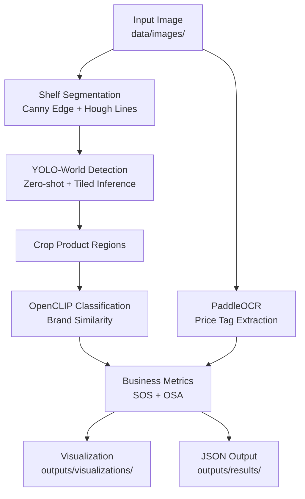

# Architecture



## Module Dependency Graph

```
main.py
  ├── configs/config.py          ← all tunable parameters + brand prompts
  ├── src/detector.py            ← YOLO-World + SAHI tiling + NMS
  ├── src/classifier.py          ← OpenCLIP zero-shot brand matching
  ├── src/ocr.py                 ← PaddleOCR / EasyOCR + noise filter
  ├── src/segmentation.py        ← Hough Lines + geometric fallback
  ├── src/metrics.py             ← SOS, OSA, report generation
  └── src/visualization.py      ← annotated image + legend + OCR strip
```

## Data Flow

```
Image (1024×768 px)
  │
  ├─ Hough Lines ──────────────────────────────────────────┐
  │   Canny(50,150) → HoughLinesP(threshold=80)            │
  │   → shelf row Y-bands                                  │
  │                                                        ▼
  └─ YOLO-World (full image + 640×640 tiles, 30% overlap) → N Detections
       │                                                   │
       ├─ OpenCLIP ViT-B/32 ──── cosine similarity ────────┘
       │   → (brand_name, confidence) per crop             │
       │                                                   │
       ├─ PaddleOCR on price tag strips ──────────────────►├
       │   → cleaned text labels                          │
       │                                                   │
       └─ Metrics (SOS, OSA) ◄────────────────────────────┘
            │
            ├─ outputs/visualizations/<name>_annotated.jpg
            └─ outputs/results/<name>_result.json
```
